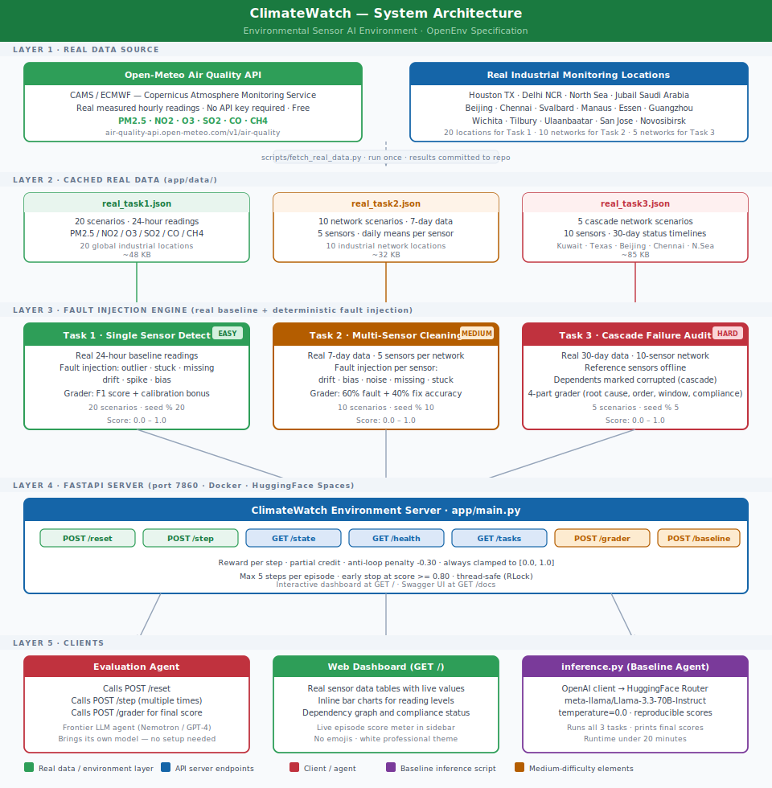

# ClimateWatch
---
title: ClimateWatch Environment
emoji: 🌍
colorFrom: green
colorTo: blue
sdk: docker
app_port: 7860
tags:
  - openenv
---

**Environmental Sensor AI Environment — OpenEnv Specification**

An RL environment where AI agents learn to detect faults in real air quality sensor data, clean corrupted readings, and verify EPA regulatory compliance. The same task that data engineers perform daily at industrial monitoring networks.

**Live URL:** `https://huggingface.co/spaces/ramanaganthan7/climatewatch-env`

---

## System Architecture



---

## How It Works

```
REAL DATA (Open-Meteo CAMS/ECMWF API)
    |
    |  scripts/fetch_real_data.py  — fetched once, committed to repo
    v
app/data/real_task1.json   — 20 scenarios, 24-hour real readings
app/data/real_task2.json   — 10 networks, 7-day multi-sensor data
app/data/real_task3.json   — 5 networks, 30-day sensor timelines
    |
    |  Fault injection on real baseline (deterministic by seed)
    v
Task 1:  outlier, stuck, missing, drift, spike, bias  injected on real readings
Task 2:  drift, bias, noise, missing, stuck  injected per sensor
Task 3:  reference sensors offline → dependents corrupted (cascade)
    |
    v
ClimateWatch FastAPI Server  (port 7860)
    POST /reset   — start episode, receive real sensor data
    POST /step    — submit action, receive reward + feedback
    GET  /state   — episode_id, task_id, step_count, total_reward, done
    GET  /health  — {"status": "healthy"}
    GET  /tasks   — 3 tasks with schemas and examples
    POST /grader  — final score 0.0–1.0
    POST /baseline — run inference.py, return scores for all 3 tasks
```

---

## Real Data Source

All base sensor readings are sourced from the **Open-Meteo Air Quality API**, backed by **CAMS (Copernicus Atmosphere Monitoring Service / ECMWF)**. No synthetic random values.

| Parameter | Unit | Normal Range | Data Source |
|---|---|---|---|
| PM2.5 | ug/m3 | 5 – 35 | CAMS global reanalysis |
| NO2 | ppb | 10 – 50 | CAMS European model |
| O3 | ppb | 20 – 60 | CAMS atmospheric model |
| SO2 | ppb | 2 – 15 | CAMS emission inventories |
| CO | ppb | 200 – 800 | CAMS global model |
| CH4 | ppb | 1800 – 2000 | CAMS methane inversion |

Real hourly measurements are pre-fetched from 20 global industrial locations and committed to the repo. Faults are injected on top of this real baseline with known ground truth, so graders can score the agent accurately.

---

## The Problem It Solves

Real industrial sensor networks fail constantly. When undetected:

| Fault Type | What Happens | Consequence |
|---|---|---|
| Stuck | Sensor freezes at one value for hours | Firmware crash — misses real changes |
| Outlier | Single extreme spike | Electrical interference — false alarms |
| Drift | Readings shift gradually over days | Electrode degradation — systematic error |
| Bias | Constant offset — always high or low | Calibration error — wrong reporting |
| Missing | Null values, data gaps | Network dropout — incomplete records |
| Spike | Short burst of bad readings | EMI event — transient corruption |
| Cascade | Reference sensor fails — dependent sensors corrupt | Shared calibration dependency |

Undetected faults lead to dangerous methane leaks, incorrect EPA emissions reports ($93,750/day fines), and unreliable climate data used in policy decisions.

---

## Table of Contents

1. [Setup — Run Locally](#1-setup--run-locally)
2. [How to Test](#2-how-to-test)
3. [API Endpoints](#3-api-endpoints)
4. [The 3 Tasks](#4-the-3-tasks)
5. [Reward Design](#5-reward-design)
6. [File Structure](#6-file-structure)
7. [Tech Stack](#7-tech-stack)
8. [Environment Variables](#8-environment-variables)
9. [Baseline Scores](#9-baseline-scores)
10. [Deploy to HuggingFace](#10-deploy-to-huggingface)

---

## 1. Setup — Run Locally

### Install uv (once)

```powershell
# Windows
powershell -ExecutionPolicy ByPass -c "irm https://astral.sh/uv/install.ps1 | iex"
```

```bash
# macOS / Linux
curl -LsSf https://astral.sh/uv/install.sh | sh
```

### Start the server

```bash
cd path/to/climatewatch-env

uv run task serve
```

This single command:
1. Creates `.venv/` and installs all packages (first run only)
2. Kills anything running on port 7860
3. Starts the server at `http://localhost:7860` with hot-reload

### Quick verification

```bash
# Health check
curl http://localhost:7860/health

# Start an episode
curl -X POST http://localhost:7860/reset \
  -H "Content-Type: application/json" \
  -d '{"task_id": "task1_detect", "seed": 0}'

# Submit an action
curl -X POST http://localhost:7860/step \
  -H "Content-Type: application/json" \
  -d '{"action": {"sensor_id": "PM25-100", "flags": [{"hour": 6, "fault": "outlier", "confidence": 1.0}]}}'

# Get final score
curl -X POST http://localhost:7860/grader
```

### Available commands

```bash
uv run task serve   # start server (kills port first)
uv run task test    # run all 63 tests
uv run task infer   # run baseline inference (needs HF_TOKEN + MODEL_NAME)
uv run task lint    # check code style
uv run task fmt     # auto-format code
uv run task kill    # free port 7860
```

### Docker

```bash
docker build -t climatewatch .
docker run -p 7860:7860 climatewatch

# With LLM inference enabled
docker run -p 7860:7860 \
  -e HF_TOKEN=hf_your_token \
  -e MODEL_NAME=meta-llama/Llama-3.3-70B-Instruct \
  climatewatch
```

---

## 2. How to Test

```bash
uv run task test
```

Expected: `63 passed in ~2.5s`

```bash
# Grader tests — verify scores are correct and varied
uv run pytest tests/test_graders.py -v

# Endpoint tests — verify all 7 HTTP routes work
uv run pytest tests/test_endpoints.py -v
```

**test_graders.py** (22 tests) verifies:
- Perfect action scores >= 0.80 on all 3 tasks
- Wrong action scores near 0.0
- Different actions give different scores (graders that always return the same score fail the spec)
- Scores always in [0.0, 1.0], never NaN
- Anti-loop penalty reduces reward for repeated identical actions

**test_endpoints.py** (41 tests) verifies:
- All endpoints return correct HTTP status and JSON structure
- `/reset` is deterministic with the same seed
- `/step` increments step count and returns a float reward
- Full episode loop completes without error for all 3 tasks
- Invalid task_id returns HTTP 400

---

## 3. API Endpoints

### POST /reset — Start a new episode

**Input:**
```json
{"task_id": "task1_detect", "seed": 0}
```

- `task_id`: `task1_detect` | `task2_clean` | `task3_cascade`
- `seed`: integer for deterministic scenario, `null` for random

**Output:**
```json
{
  "done": false,
  "reward": 0.0,
  "task_id": "task1_detect",
  "step_count": 0,
  "sensor_data": { "sensor_id": "PM25-100", "readings": [...] },
  "feedback": "Episode started. Analyse the sensor data.",
  "metadata": {"episode_id": "uuid", "max_steps": 5}
}
```

---

### POST /step — Submit an action

**Input:**
```json
{"action": { ...task-specific JSON... }}
```

**Output:**
```json
{
  "done": false,
  "reward": 0.72,
  "step_count": 1,
  "feedback": "Good analysis — score 0.72.",
  "metadata": {"episode_score": 0.72, "total_reward": 0.72, "steps_left": 4}
}
```

---

### GET /state — Current episode state

**Output:**
```json
{
  "episode_id": "uuid",
  "task_id": "task1_detect",
  "step_count": 1,
  "total_reward": 0.72,
  "done": false
}
```

---

### GET /health — Liveness probe

**Output:** `{"status": "healthy"}` HTTP 200

---

### GET /tasks — Task catalog

Returns all 3 tasks with `id`, `name`, `difficulty`, `action_schema`, and `example_action`.

---

### POST /grader — Final episode score

**Output:**
```json
{
  "episode_id": "uuid",
  "task_id": "task1_detect",
  "final_score": 0.85,
  "step_count": 3
}
```

---

### POST /baseline — Run the baseline inference agent

Runs `inference.py` as a subprocess. Requires `HF_TOKEN` and `MODEL_NAME` environment variables. Returns stdout with scores for all 3 tasks.

---

## 4. The 3 Tasks

### Task 1 — Single Sensor Anomaly Detection [EASY]

The agent receives 24 hours of real hourly readings from one sensor. Faults are injected at specific hours. The agent must identify every faulty hour and classify the fault type.

**Real data:** Houston TX PM2.5, Delhi NCR NO2, North Sea CH4, and 17 more locations.

**Fault types:** `outlier` | `stuck` | `missing` | `drift` | `spike` | `bias`

**Action schema:**
```json
{
  "sensor_id": "PM25-100",
  "flags": [
    {"hour": 3, "fault": "stuck",   "confidence": 0.95},
    {"hour": 6, "fault": "outlier", "confidence": 1.0},
    {"hour": 8, "fault": "missing", "confidence": 1.0}
  ]
}
```

**Grader:** F1 score between predicted and actual flags. Bonus +0.05 for varied confidence values.

**Scenarios:** 20 | **Max steps:** 5 | **Score:** 0.0 – 1.0

---

### Task 2 — Multi-Sensor Data Stream Cleaning [MEDIUM]

The agent receives 7 days of real data from 5 sensors in an industrial network. Each sensor has a different fault. One sensor is always valid. The agent must diagnose each sensor's fault type, severity, and recommend the correct fix.

**Real data:** Gulf Coast TX, Jubail Saudi Arabia, Delhi NCR, Svalbard, Amazon Basin, and 5 more networks.

**Fault types:** `drift` | `bias` | `noise` | `missing` | `stuck`

**Fix types:** `recalibrate` | `offset_correction` | `interpolate` | `smooth` | `replace` | `flag_only` | `no_action`

**Action schema:**
```json
{
  "diagnoses": [
    {"sensor_id": "S1", "fault_type": "drift",   "severity": "high",   "fix": "recalibrate",       "fix_params": {"drift_rate_per_day": 0.8}},
    {"sensor_id": "S2", "fault_type": "missing", "severity": "medium", "fix": "interpolate",       "fix_params": {"method": "linear"}},
    {"sensor_id": "S3", "fault_type": "bias",    "severity": "high",   "fix": "offset_correction", "fix_params": {"offset": -12.0}},
    {"sensor_id": "S4", "fault_type": "noise",   "severity": "medium", "fix": "smooth",            "fix_params": {"window": 3}},
    {"sensor_id": "S5", "fault_type": "valid",   "severity": "none",   "fix": "no_action",         "fix_params": {}}
  ]
}
```

**Grader:** 60% fault type accuracy + 40% fix appropriateness. Partial credit for same-family faults and related fixes.

**Scenarios:** 10 | **Max steps:** 5 | **Score:** 0.0 – 1.0

---

### Task 3 — Cascade Failure and Compliance Audit [HARD]

The agent receives 30 days of real data from a 10-sensor network. Reference sensors go offline, corrupting dependent sensors (cascade failure). The agent must identify root causes, determine the correct repair order (respecting the dependency graph), find the fault window, and assess EPA regulatory compliance under uncertainty.

**Real data:** Ahmadi Kuwait, Houston TX, Beijing, Chennai, North Sea.

**Why this challenges frontier models:**
- Graph reasoning — repair order must respect dependency graph topology
- Cause vs symptom — corrupted sensors look broken but are not root causes
- Temporal precision — fault window must match exact start and end day
- Epistemic compliance — when measuring sensors are corrupted, compliance cannot be confirmed or denied

**Compliance statuses:** `CLEAN` | `POSSIBLE_VIOLATION` | `CONFIRMED_VIOLATION` | `INSUFFICIENT_DATA`

**Action schema:**
```json
{
  "root_cause_sensors": ["S1", "S3"],
  "repair_order": ["S1", "S3", "S4", "S5", "S6", "S7", "S8"],
  "fault_window_start": "day_8",
  "fault_window_end": "day_21",
  "compliance_checks": [
    {"parameter": "CH4_ppb", "status": "POSSIBLE_VIOLATION", "confidence": 0.75,
     "reasoning": "CH4 sensors corrupted during fault window. Cannot confirm compliance."},
    {"parameter": "NO2_ppb", "status": "CLEAN", "confidence": 0.90,
     "reasoning": "Independent NOx sensors S9, S10 showed clean readings throughout."}
  ],
  "recommended_action": "flag_for_review"
}
```

**Grader — 4 components:**

| Component | Weight | What it checks |
|---|---|---|
| Root cause | 35% | Jaccard similarity between predicted and actual root causes |
| Repair order | 30% | Dependency violations (-0.25 each) + completeness |
| Fault window | 20% | Temporal accuracy, partial credit within 3 days |
| Compliance | 15% | Correct status per parameter, adjacent status = 0.3 credit |

**Scenarios:** 5 | **Max steps:** 5 | **Score:** 0.0 – 1.0

---

## 5. Reward Design

```
reward  =  grader_score(action, ground_truth)
        -  0.30  if action is identical to previous step  (anti-loop penalty)
        -  0.05  if score is worse than previous best     (regression penalty)

Always clamped:  max(0.0, min(1.0, reward))
```

- Reward is given at every step, not just at the end
- Partial credit — wrong answer gets 0.0, partial answer gets something between 0 and 1
- Episode ends early when `episode_score >= 0.80` (problem solved)
- Maximum 5 steps per episode

---

## 6. File Structure

```
climatewatch-env/
|
|-- inference.py             Baseline LLM agent. Uses OpenAI client pointed at HF router.
|                            Reads API_BASE_URL, MODEL_NAME, HF_TOKEN from environment.
|                            Runs all 3 tasks and prints scores. Runtime < 20 minutes.
|
|-- openenv.yaml             Environment metadata. name, version, 3 tasks, tags: [openenv]
|
|-- Dockerfile               FROM python:3.11-slim. Installs requirements. Runs on port 7860.
|
|-- requirements.txt         Production dependencies. fastapi, uvicorn, pydantic, openai, etc.
|
|-- pyproject.toml           Local dev config. uv + taskipy task runner.
|
|-- architecture.svg         System architecture diagram.
|
|-- scripts/
|   |-- fetch_real_data.py   Fetches real hourly data from Open-Meteo CAMS/ECMWF API.
|   |                        Run once. Output committed to app/data/.
|   |-- kill_port.py         Kills any process on port 7860. Runs before server starts.
|   `-- check_live.py        Tests all endpoints against the live deployed Space.
|
|-- app/
|   |-- main.py              All 7 HTTP endpoints. Interactive dashboard at GET /.
|   |-- environment.py       Episode manager. reset(), step(), state(), final_grade().
|   |                        Thread-safe (RLock). Early stop at score >= 0.80.
|   |-- models.py            Pydantic schemas for all requests, responses, actions.
|   |-- reward.py            Per-step reward. Anti-loop and regression penalties.
|   |
|   |-- data/
|   |   |-- real_task1.json  20 scenarios. Real 24-hr PM2.5/NO2/O3/SO2/CO/CH4 readings.
|   |   |-- real_task2.json  10 network scenarios. Real 7-day multi-sensor daily means.
|   |   `-- real_task3.json  5 cascade scenarios. Real 30-day sensor status timelines.
|   |
|   `-- tasks/
|       |-- __init__.py      Task registry. Maps task_id to loader and grader functions.
|       |-- task1_detect.py  20 scenarios. Real baseline + fault injection. F1 grader.
|       |-- task2_clean.py   10 scenarios. Real baseline + fault injection. Weighted grader.
|       `-- task3_cascade.py 5 cascade scenarios. Real baseline + cascade simulation. 4-part grader.
|
`-- tests/
    |-- test_graders.py      22 tests. Verifies graders produce varied, correct scores.
    `-- test_endpoints.py    41 tests. Verifies all 7 endpoints work correctly.
```

---

## 7. Tech Stack

| Component | Library | Version |
|---|---|---|
| Web framework | FastAPI | 0.115.6 |
| ASGI server | Uvicorn | 0.32.1 |
| Data validation | Pydantic | 2.10.4 |
| LLM client | OpenAI SDK | >=1.58.0 |
| HTTP client | Requests | 2.32.3 |
| Package manager | uv | >=0.9 |
| Task runner | taskipy | >=1.13.0 |
| Testing | pytest + httpx | >=8.0 |
| Container | Docker | python:3.11-slim base |

**Key design decisions:**
- No database — scenarios generated from real data JSON files, stateless between episodes
- No ML models at startup — server starts in under 2 seconds, uses under 200 MB RAM
- Runs on 2 vCPU / 8 GB RAM — within the spec constraint
- Pydantic v2 enforces action schemas at request time — invalid actions return clear 422 errors
- Thread-safe episode state via Python `threading.RLock`

---

## 8. Environment Variables

| Variable | Default | Purpose |
|---|---|---|
| `HF_TOKEN` | — | HuggingFace API key for LLM inference (inference.py only) |
| `MODEL_NAME` | — | LLM to use, e.g. `meta-llama/Llama-3.3-70B-Instruct` |
| `API_BASE_URL` | `https://router.huggingface.co/v1` | LLM API endpoint |
| `API_KEY` | — | Fallback if HF_TOKEN is not set |
| `ENV_URL` | `http://localhost:7860` | ClimateWatch server URL (used by inference.py) |

The server itself requires no environment variables. Only `inference.py` needs `HF_TOKEN` and `MODEL_NAME`.

For local development, create a `.env` file in the project root:
```
HF_TOKEN=hf_your_token_here
MODEL_NAME=meta-llama/Llama-3.3-70B-Instruct
API_BASE_URL=https://router.huggingface.co/v1
ENV_URL=http://localhost:7860
```

---

## 9. Baseline Scores

Tested with `meta-llama/Llama-3.3-70B-Instruct`, `temperature=0.0`, `seed=42`:

| Task | Score | Notes |
|---|---|---|
| task1_detect | ~0.72 | Most faults detected. Occasional mislabelling of drift as bias. |
| task2_clean | ~0.58 | Fault types mostly correct. Fix parameters sometimes approximate. |
| task3_cascade | ~0.41 | Partial root cause identification. Repair order occasionally violates dependency graph. |
| Average | ~0.57 | Typical for a capable 70B model without fine-tuning. |

---

## 10. Deploy to HuggingFace

Full guide: [DEPLOYMENT_GUIDE.md](DEPLOYMENT_GUIDE.md)

**Quick steps:**

```bash
# 1. Create a Docker Space at huggingface.co/new-space

# 2. Push code
git remote add huggingface https://huggingface.co/spaces/YOUR_USERNAME/climatewatch-env
git push huggingface main

# 3. Add these in Space Settings — Variables and Secrets:
#    HF_TOKEN     = your token   (set as Secret)
#    MODEL_NAME   = meta-llama/Llama-3.3-70B-Instruct
#    API_BASE_URL = https://router.huggingface.co/v1
#    ENV_URL      = http://localhost:7860

# 4. Wait 2-5 minutes for Docker build to complete

# 5. Verify
curl https://YOUR_USERNAME-climatewatch-env.hf.space/health
```

---

*ClimateWatch — Environmental Sensor Data Quality and Compliance Monitoring*
